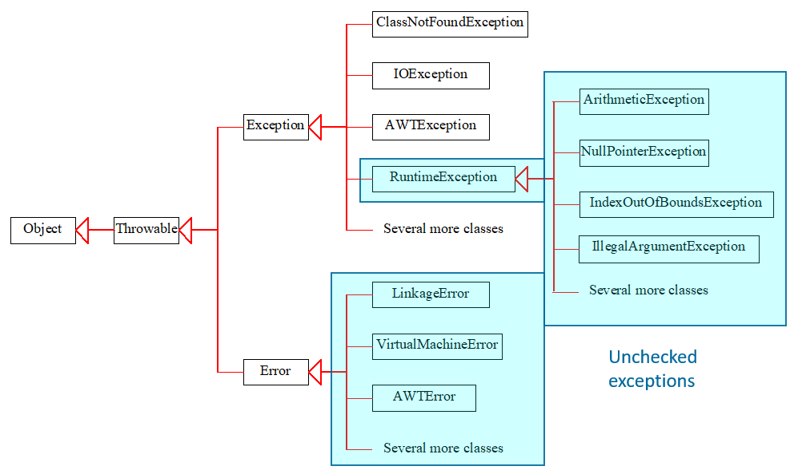

# Exceptions Overview

## Agenda
+ What is an Exception?
+ The Three Kinds of Exceptions
+ Materials

## What is an Exception?
### Throwing an exception
**An exception** is an event that occurs during the execution of a program that disrupts the normal flow of instructions.

**Throwing an exception** is the process of creating an exception object and handing it to the runtime system.

### The call stack
**The call stack** is the ordered list of methods that had been called to get to the method where the error occurred.

### A stack trace
**A Stack trace** is an information on the execution history of the current thread and lists the names of the classes and methods that were called at the point when the exception occurred.

## The Three Kinds of Exceptions
### Checked, Unchecked Exception and Error
**A Checked Exception** is an exceptional condition that a well-written application should anticipate and recover from. If your code invokes a method which is defined to throw checked exception, your code MUST provide a catch handler. The compiler generates an error if the appropriate catch handler is not present.

**An Error** is an exceptional condition that is external to the application, and that the application usually cannot anticipate or recover from.

**A Runtime Exception** is an exceptional conditions that is internal to the application, and that the application usually cannot anticipate or recover from.

**An Unchecked Exception** is the exception indicated by Errors and Runtime Exceptions.

### Exception Hierarchy

## Materials
https://docs.oracle.com/javase/tutorial/essential/exceptions/index.html

https://www.geeksforgeeks.org/exceptions-in-java

https://www.javatpoint.com/exception-handling-in-java