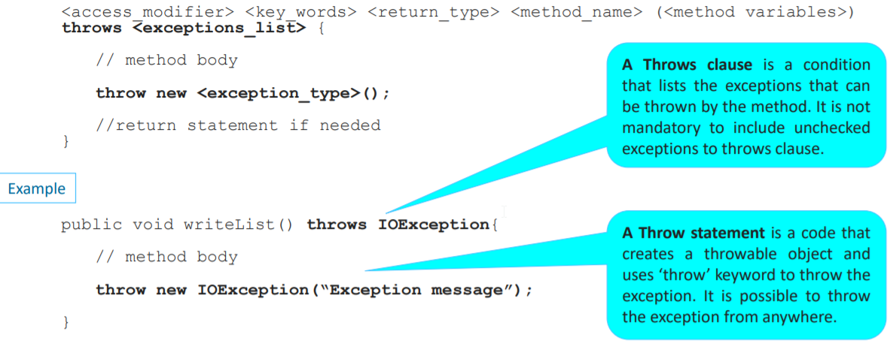

# The Exceptions Thrown by a Method

## Agenda
+ [Throws and Throw syntax](#throws-and-throw-syntax)
+ [Exceptions and Method Overriding](#exceptions-and--method-overriding)
+ [Materials](#materials)

## <a id="throws-and-throw-syntax"></a> Throws and Throw syntax



## <a id="exceptions-and--method-overriding"></a> Exceptions and Method Overriding
To handle the exception while you overriding a method in Java, you will have to follow three important rules. They are
as follows:

1. If an overridden method does not throw an exception using throws clause then

    + The overriding method can not throw any checked or compile-time exception.
    + The overriding method can throw any unchecked or runtime exception.

2. If an overridden method throws an unchecked or runtime exception then

    + The overriding method can throw any unchecked or runtime exception.
    + The overriding method can throw the same exception which is thrown by the overridden method.
    + The overriding method can ignore the method level exception.

3. If the superclass method throws checked or compile-time exception then

    + Subclass method can throw an exception which is a subclass of the superclass method’s exception.
    + Subclass method cannot throw the exception which is a superclass of the superclass method’s exception.
    + Subclass method can throw any unchecked or runtime exception.

Look at the below figure to understand better.


Let’s take different types of example programs based on these rules.

```java
public class Parent {
  // Overridden method is not throwing an exception. 
  void msg() {
    System.out.println("msg-Parent");
  }
}

public class Child extends Parent {
  void msg() throws IOException // Compile-time error because the overriding method is throwing a checked exception. 
  {
    System.out.println("msg-Child");
  }

  public static void main(String[] args) throws IOException {
    Parent p = new Child();
    p.msg();

    Child c = new Child();
    c.msg();
  }
}
```

```Output: 
Unresolved compilation problem: Exception IOException is not compatible with throws clause in Parent.msg()
```

In the above example program, if overriding method throws an unchecked exception, there will be no compile-time error.
Look at the program source code.

```java
public class Parent {
  // Overridden method is not throwing an exception. 
  void msg() {
    System.out.println("msg-Parent");
  }
}

public class Child extends Parent {
  void msg() throws ArithmeticException // No compile-time error because the overriding method is throwing an unchecked exception. 
  {
    System.out.println("msg-Child");
  }

  public static void main(String[] args) throws IOException {
    Parent p = new Child();
    p.msg();
    Child c = new Child();
    c.msg();
  }
}
```

```
Output: 
       msg-Child 
       msg-Child
```

In the above example program, if overriding method throws an unchecked exception, there will be no compile-time error.
Look at the program source code.

## <a id="materials"></a> Materials
https://docs.oracle.com/javase/tutorial/essential/exceptions/index.html

https://www.geeksforgeeks.org/exceptions-in-java

https://www.javatpoint.com/exception-handling-in-java
